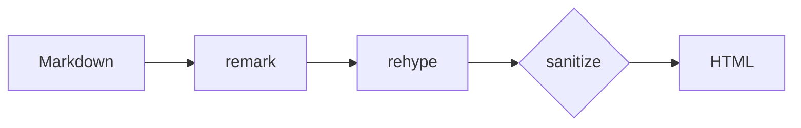
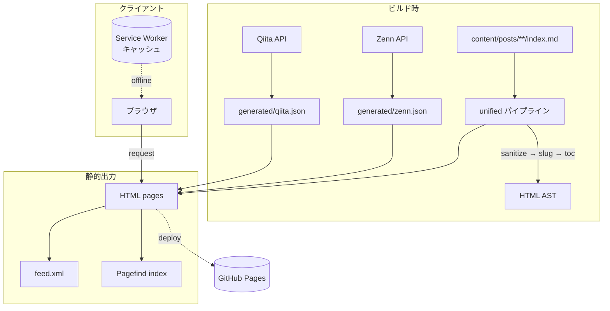
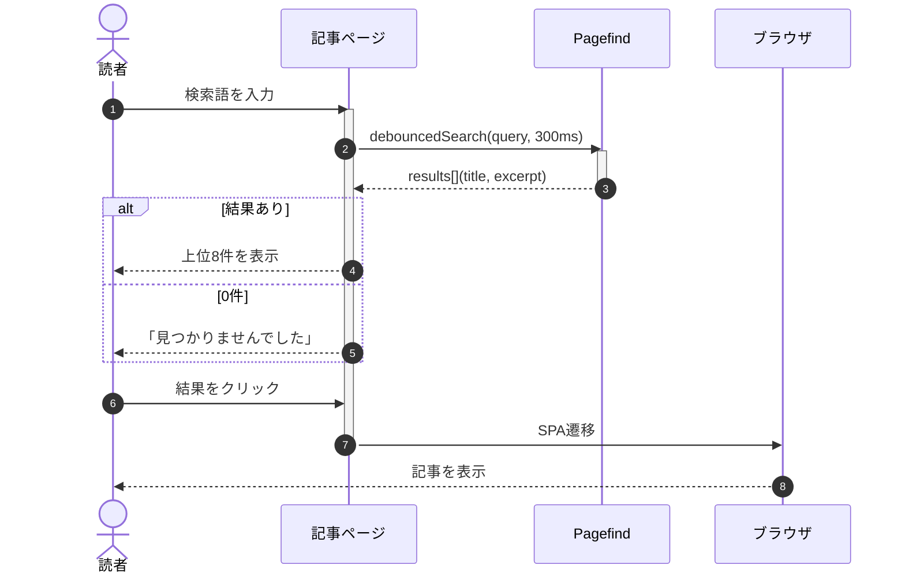
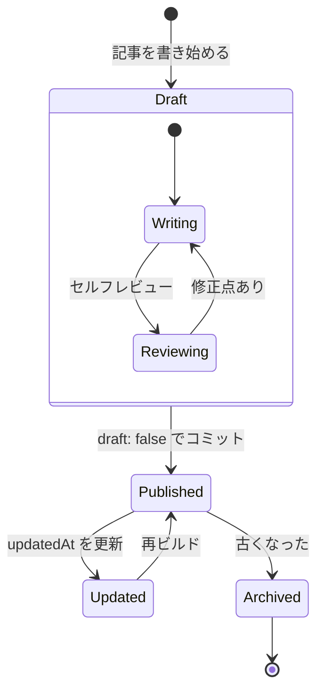
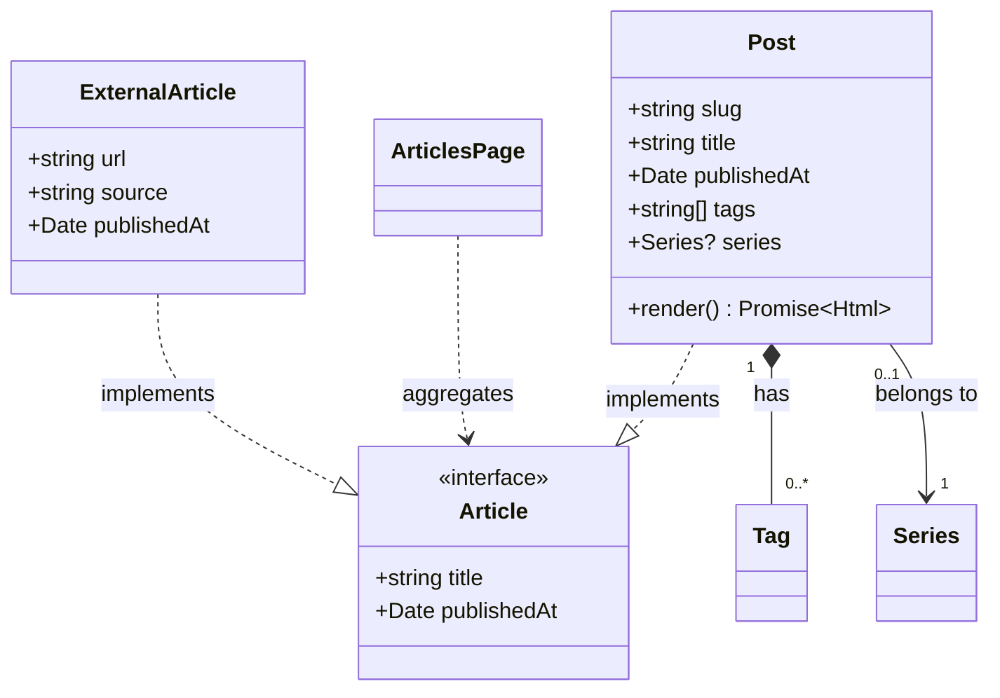
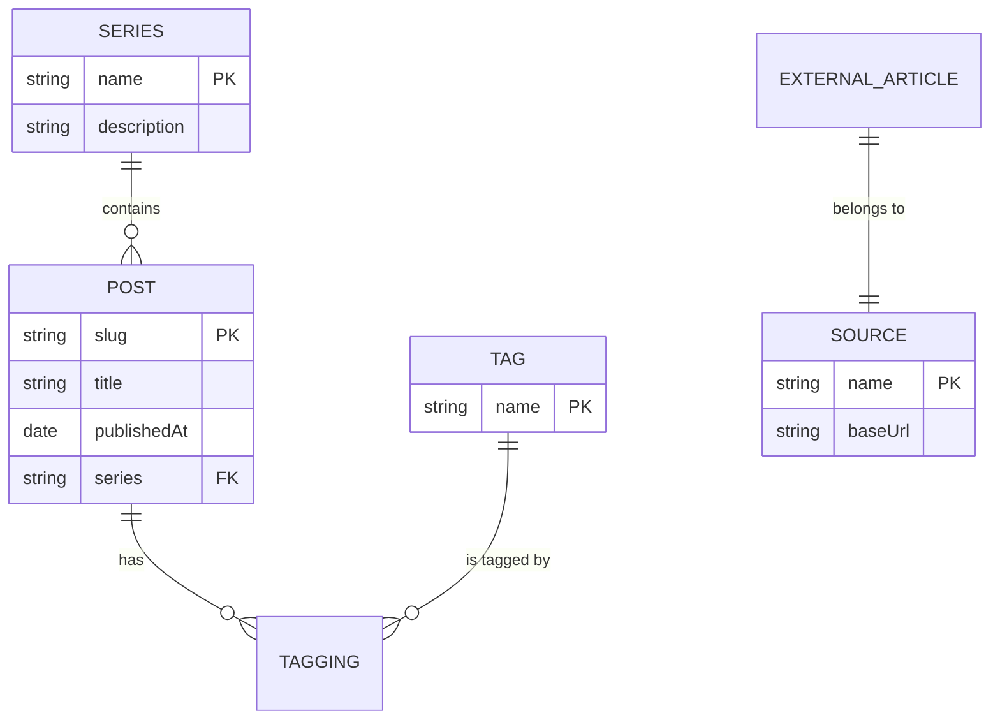
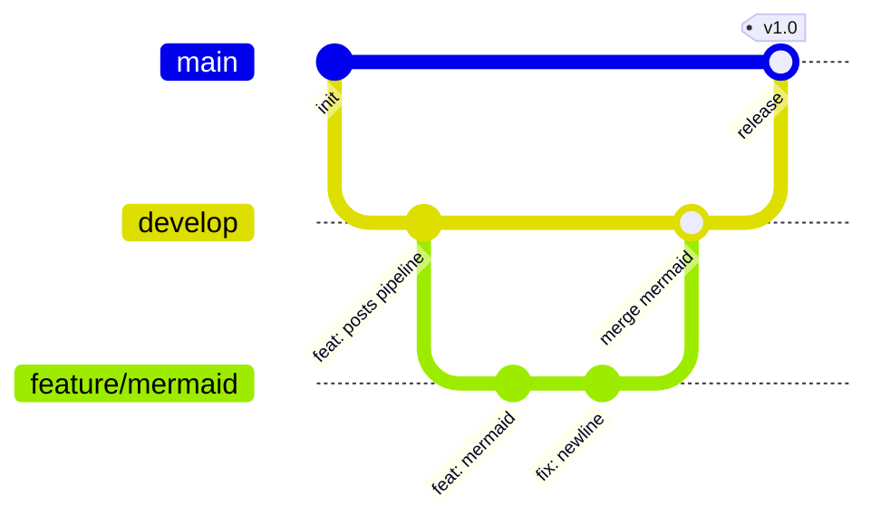

この記事はMarkdownパイプラインの表示確認用です。各種要素が正しくレンダリングされるかを一覧できます。

## 見出しと目次

h2/h3が3つ以上あると目次が表示されます。

### サブ見出し h3

h3は目次でインデントされます。

#### h4以降

h4以降は目次に出ません。

## テキスト装飾

**太字**、*斜体*、~~取り消し線~~、`inline code`、そして[外部リンク](https://example.com)と[内部リンク](/about/)の区別。

> 引用ブロックです。
> 複数行にわたる引用。

## コードブロック

言語指定でShikiハイライトが効きます。

```ts:src/utils/greet.ts
interface User {
  name: string;
  age: number;
}

const greet = (user: User): string => `Hello, ${user.name}!`;
```

`{!}`マーカーで行ハイライト:

```ts
const a = 1;
const b = 2; // [!code highlight]
const c = 3;
```

diff記法:

```ts
const old = "removed"; // [!code --]
const fresh = "added"; // [!code ++]
```

## 数式

インライン数式: オイラーの等式 $e^{i\pi} + 1 = 0$ が美しい。

ブロック数式:

$$
\int_{-\infty}^{\infty} e^{-x^2} \, dx = \sqrt{\pi}
$$

## Mermaid図



複雑なフローチャート(サブグラフ・複数経路):



シーケンス図(参加者・ループ・条件分岐):



状態遷移図(複合状態・分岐):



クラス図(継承・関連・多重度):



ER図(リレーションと属性):



Gitグラフ(ブランチ・マージ):



## アラート

> [!NOTE]
> 補足情報です。

> [!WARNING]
> 注意が必要な内容です。

> [!IMPORTANT]
> 重要な内容です。

## テーブル

| 要素 | 対応 |
|------|------|
| コード | Shiki |
| 数式 | KaTeX |
| 図 | Mermaid |

## タスクリスト

- [x] 実装済みの項目
- [ ] 未実装の項目

## 画像

同じフォルダに置いた画像を相対パスで参照します。


## Raw HTML

安全なHTMLはそのまま使えます。危険なものはsanitizeで除去されます。

<details>
  <summary>折りたたみの例</summary>

  details/summaryで折りたたみコンテンツを作れます。

</details>

キーボード表記: <kbd>Ctrl</kbd> + <kbd>C</kbd>

## 脚注

脚注のあるテキストです[^1]。複数の脚注[^note]も使えます。

[^1]: これは脚注です。
[^note]: 名前付き脚注です。

## 区切り線

---

以上でテストは終わりです。
