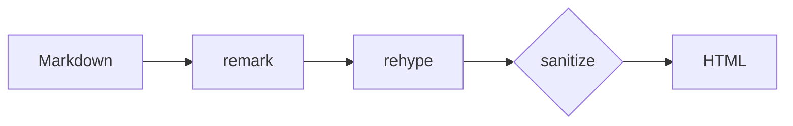
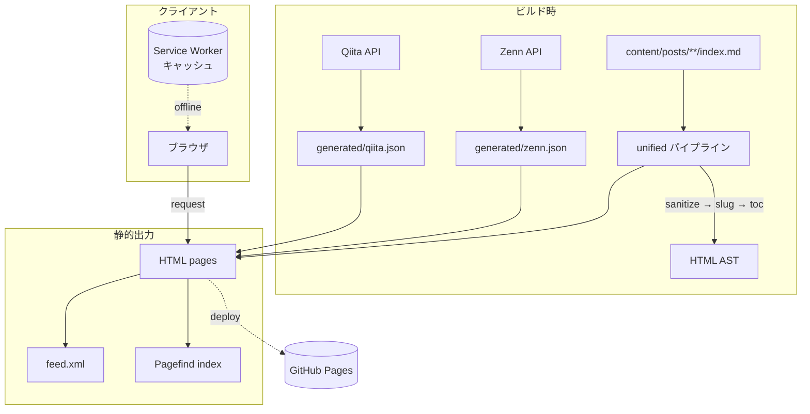
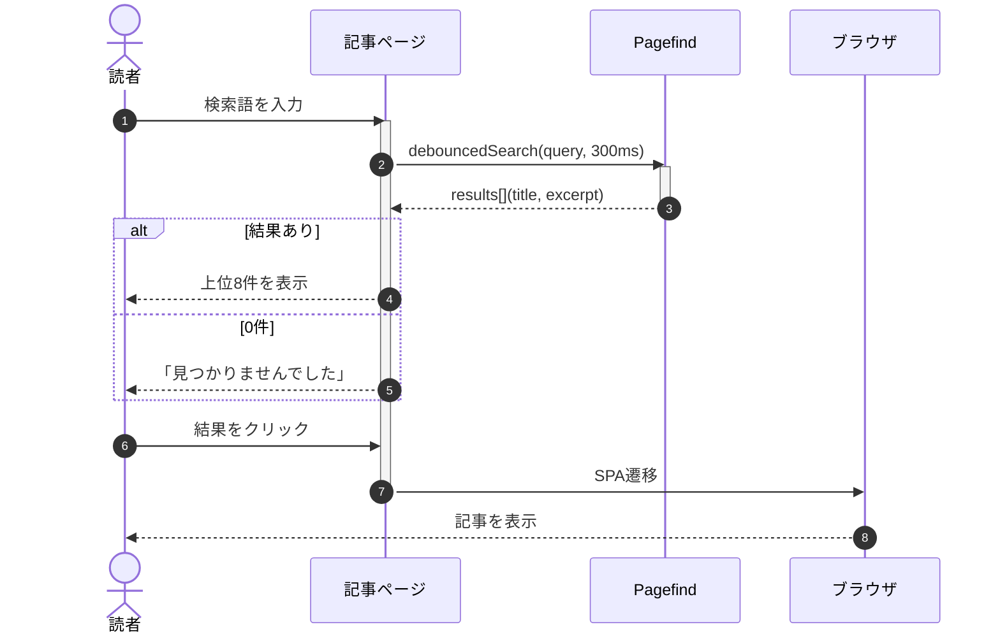
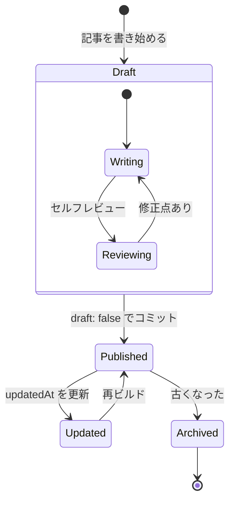
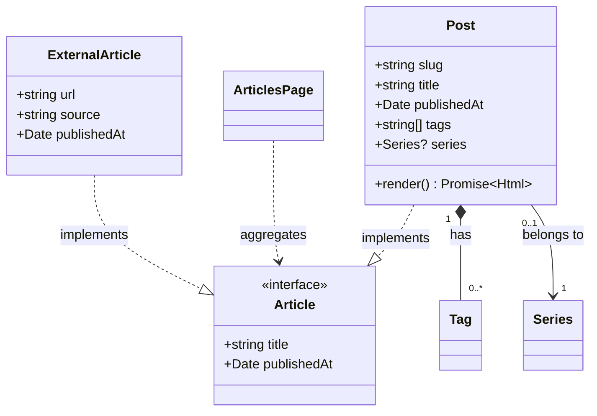
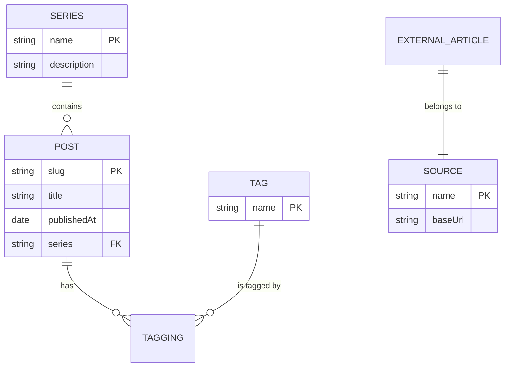
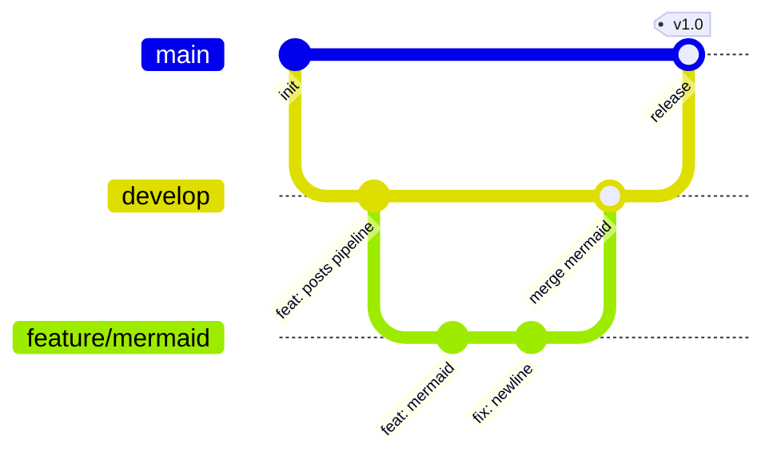

この記事はMarkdownパイプラインの表示確認用です。各種要素が正しくレンダリングされるかを一覧できます。後半には実際の記事に近い密度の本文を並べているので、段落のリズムや行間、余白の見え方もここで確認します。

## 見出しと目次

h2/h3が3つ以上あると目次が表示されます。

### サブ見出し h3

h3は目次でインデントされます。

#### h4以降

h4以降は目次に出ません。本文と同じサイズの太字になります。

##### h5の表示

h5は本文より少し小さい太字です。Tailwind typographyはh4までしかスタイルを当てないので、h5/h6は独自のルールを追加しています。

###### h6の表示

h6はh5とほぼ同じサイズで、色をミュートにして階層を表現します。GitHubの作法に倣った設計です。

## テキスト装飾

**太字**、*斜体*、~~取り消し線~~、`inline code`、そして[外部リンク](https://example.com)と[内部リンク](/about/)の区別。**太字の中の`コード`や[リンク](https://example.com)**といったネストした装飾も確認できます。

日本語の文章中で**強調を使うとどう見えるか**、あるいは*斜体は日本語ではあまり使われない*のですが、英単語の*emphasis*には自然に効きます。`const`や`let`のようなインラインコードを文中に置くと、モノスペースの小さな背景色付きの塊になります。

> 引用ブロックです。
> 複数行にわたる引用。

> 引用の中に段落を2つ置くパターンです。
>
> ここが2つ目の段落。空の`>`行で区切ります。

> 引用の中にリストやコードを混ぜるパターン:
>
> - 箇条書きも入る
> - 2番目の項目
>
> ```ts
> const quoted = "code inside a quote";
> ```

> 引用のネスト。
>
> > さらに深い引用。2段目はどう見えるか。

## コードブロック

言語指定でShikiハイライトが効きます。ファイル名は`lang:path`記法でバーに表示されます。

```ts:src/utils/greet.ts
interface User {
  name: string;
  age: number;
}

const greet = (user: User): string => `Hello, ${user.name}!`;
```

言語名だけの場合、バーには言語が表示されます:

```python
def fib(n: int) -> int:
    if n < 2:
        return n
    return fib(n - 1) + fib(n - 2)
```

シェルスクリプト:

```bash
pnpm install --frozen-lockfile
pnpm run validate && pnpm build
```

JSON:

```json
{
  "name": "naatin777-dev",
  "scripts": {
    "build": "vite build && pagefind && node scripts/generate-og.mjs"
  }
}
```

YAML(frontmatter風):

```yaml
title: "サンプル記事"
publishedAt: 2026-09-23
tags: [sveltekit, markdown]
draft: false
```

CSS:

```css
:root {
  --background: #fafafa;
  --foreground: #171717;
}
```

言語指定なしのフェンス:

```
この中はプレーンテキスト。
URLやログの貼り付け向け。https://example.com/some/path
```

長い行を含むブロック(横スクロールの確認):

```ts
const veryLongFunctionName = async (firstArgument: string, secondArgument: number, thirdArgument: { nested: { deeply: string } }) => {
  return `https://example.com/api/v1/some/very/long/path?query=${encodeURIComponent(firstArgument)}&count=${secondArgument}`;
};
```

`{!}`マーカーで行ハイライト:

```ts
const a = 1;
const b = 2; // [!code highlight]
const c = 3;
```

diff記法:

```ts
const old = "removed"; // [!code --]
const fresh = "added"; // [!code ++]
```

## 数式

インライン数式: オイラーの等式 $e^{i\pi} + 1 = 0$ が美しい。文中に $\frac{a}{b}$ や $\sum_{i=1}^{n} i$ を入れても違和感なく収まるかを見ます。

ブロック数式:

$$
\int_{-\infty}^{\infty} e^{-x^2} \, dx = \sqrt{\pi}
$$

$$
\frac{\partial}{\partial t} \Psi = \frac{i\hbar}{2m} \nabla^2 \Psi
$$

$$
\mathbf{A} = \begin{pmatrix} a & b \\ c & d \end{pmatrix}, \quad \det \mathbf{A} = ad - bc
$$

## Mermaid図



複雑なフローチャート(サブグラフ・複数経路):



シーケンス図(参加者・ループ・条件分岐):



状態遷移図(複合状態・分岐):



クラス図(継承・関連・多重度):



ER図(リレーションと属性):



Gitグラフ(ブランチ・マージ):



## アラート

> [!NOTE]
> 補足情報です。記事の流れを止めない程度のメモに使います。

> [!TIP]
> 知っておくと得する小技や推奨設定など。

> [!IMPORTANT]
> 重要な内容です。読み飛ばすと後で困るかもしれない点。

> [!WARNING]
> 注意が必要な内容です。設定ミスで壊れる操作など。

> [!CAUTION]
> 危険な操作の警告。データが消える可能性がある処理など。

複数段落を含むアラート:

> [!NOTE]
> アラート内の最初の段落。改行しても同じボックスに入ります。
>
> 2つ目の段落。リストも入れられます:
>
> - アラート内の箇条書き
> - もう1つ

## テーブル

| 要素 | 対応 |
|------|------|
| コード | Shiki |
| 数式 | KaTeX |
| 図 | Mermaid |

配置指定(左・中央・右):

| 左寄せ | 中央 | 右寄せ |
|:-----|:----:|------:|
| alpha | 1 | 100 |
| beta | 22 | 2,000 |
| gamma | 333 | 30,000 |

セル内の装飾:

| 機能 | 構文例 | 備考 |
|------|--------|------|
| 行ハイライト | `// [!code highlight]` | 行全体に帯 |
| 差分 | `// [!code ++]` | 緑の帯と`+` |
| ファイル名 | `` ```ts:path `` | バーに表示 |

## タスクリスト

- [x] 実装済みの項目
- [ ] 未実装の項目
  - [x] ネストした完了項目
  - [ ] ネストした未完了項目
- [x] `pnpm run validate`が通る

## リスト

順序なしリストのネスト:

- 第1レベル
  - 第2レベル
    - 第3レベル
      - 第4レベルはどう見える?
  - 第2レベルの2番目
- 第1レベルの2番目

順序付きリスト:

1. リポジトリをクローンする
2. `pnpm install --frozen-lockfile`で依存を入れる
   1. ネストした番号付き項目
   2. その2
3. `pnpm dev`で開発サーバーを起動する
4. `pnpm build`で静的出力を確認する

リストの中の複数要素:

- 項目に段落を持たせることもできます。

  これは同じ項目の2段落目です。

- コードブロックも入ります:

  ```bash
  echo "list item code"
  ```

## 画像

同じフォルダに置いた画像を相対パスで参照します。


## Raw HTML

安全なHTMLはそのまま使えます。危険なものはsanitizeで除去されます。

<details>
  <summary>折りたたみの例</summary>

  details/summaryで折りたたみコンテンツを作れます。

</details>

<details>
  <summary>ネストした折りたたみ</summary>

  外側のdetails。

  <details>
    <summary>内側のdetails</summary>
    ネストしても動きます。
  </details>

</details>

キーボード表記: <kbd>Ctrl</kbd> + <kbd>C</kbd>、ファイル保存は <kbd>Cmd</kbd> + <kbd>S</kbd>

その他のインライン要素: <mark>ハイライト</mark>、H<sub>2</sub>O、x<sup>2</sup>、<abbr title="HyperText Markup Language">HTML</abbr>、コマンド出力は<samp>Done in 1.2s</samp>、変数は<var>x</var>。

## 脚注

脚注のあるテキストです[^1]。複数の脚注[^note]も使えます。同じ脚注への参照を繰り返すこともできます[^1]。

[^1]: これは脚注です。
[^note]: 名前付き脚注です。

## 区切り線

---

## 実際の記事に近い本文の密度確認

ここからは、要素のカタログではなく普通の文章が続く状態を確認するためのセクションです。実際の技術記事ではコードブロックと文章が交互に並び、時々図や表が挟まります。リズムと余白が自然かどうかを見るのが目的です。

### 背景と動機

個人サイトを作り直すとき、最初に考えるのは「何を載せるか」ではなく「どうやって書くか」でした。記事を書くたびにコンポーネントの使い方を思い出す必要があると、書くこと自体が億劫になります。Markdownで書けて、数式と図が使えて、コードがきれいに見える — この3点がそろっていれば、あとは細かい装飾を足すだけです。

静的サイトジェネレータを選ぶ基準は人それぞれですが、個人的には「ビルド時に全部済ませる」ことを重視しています。クライアント側で重い処理をすると、読者の端末に負担をかけますし、表示がちらつきます。Markdownの変換、シンタックスハイライト、数式の組版、図の描画はすべてビルド時に完了させて、ブラウザには静的なHTMLだけを渡す方がよいでしょう。

### パイプラインの設計

このサイトのMarkdown処理はunified系のプラグインで構成されています。`remark`でMarkdownをASTにし、`rehype`でHTMLに変換し、その間に各種プラグインを挟む形です。

```ts
unified()
  .use(remarkParse)
  .use(remarkGfm)
  .use(remarkMath)
  .use(remarkRehype)
  .use(rehypeRaw)
  .use(rehypeSanitize, schema)
  .use(rehypeKatex)
  .use(rehypeStringify)
```

ポイントは、パースとレンダリングの間に「信頼境界」があることです。作者が書いたMarkdownはすべてsanitizeを通り、KaTeXやShikiが生成するHTMLはその後に挿入されます。つまり自分の書き損じでページが壊れることはありませんが、パイプラインが生成した構造は信頼済みとしてそのまま出力されます。

実際のところ、この分離はコードを書く側にもメリットがあります。「このHTMLはどこから来たか」を常に意識するようになるので、後から機能を足すときもどこにプラグインを挟むべきかが自明になるのです。

### 画像とアセット

記事ごとにフォルダを切り、画像はそのフォルダに置いて相対パスで参照する方式にしました。

```md

```

ビルド時に`import.meta.glob`で全画像を拾い、相対パスを実際のアセットURLに解決します。記事と画像が同じ場所にあるので、記事を移動しても参照が切れません。ZennやQiitaの記事フォーマットも同じ思想なので、外部記事をローカルに同期したときも整合性が保てます。

### パフォーマンスの話

静的サイトなので速いのは当然として、それでも気をつけている点がいくつかあります。まずフォント。Webフォントは`font-display`の設定次第でリロード時にガタつきます。次に画像。`loading="lazy"`を全画像に付けて、記事が長くてもファーストビュー以外の画像を遅延読み込みします。最後にJSの量。ページごとのスクリプトを最小限にして、対話要素は委譲イベントで賄っています。

| 対象 | 施策 | 効果 |
|:-----|:-----|:-----|
| フォント | preload + display調整 | ガタつき軽減 |
| 画像 | lazy loading | 初期転送量削減 |
| コード | ビルド時ハイライト | クライアントJSゼロ |
| 図 | ビルド時SVG化 | 同上 |
| 数式 | rehype-katex | 同上 |

これらはすべて「ビルド時にやる」という方針の延長です。ブラウザに渡すのは完成したHTMLと最小限のCSSだけ、というのがこのサイトの基本形です。

### 運用の話

記事を書くときの流れはこんな感じです:

1. `content/posts/YYYY/`にフォルダを作る
2. `index.md`にfrontmatterと本文を書く
3. 画像があれば同じフォルダに置く
4. `pnpm dev`でプレビューしてからコミット

外部記事(ZennやQiita)はビルド時にAPIから取ってきて一覧に混ぜます。ローカル記事と外部記事を同じインターフェースで扱うので、一覧ページやフィルタリングのコードは分岐なしで済みます。

> [!TIP]
> 記事のdraftフラグを`true`にしておくと、ビルドに含まれません。書きかけの記事をリポジトリに置いておけるので便利です。

## 細かい確認事項

### 連続する段落の読みやすさ

日本語の長い段落が続くと、行間や段落間の余白が読みやすさを左右します。あまり詰まっていると息苦しく、広すぎると段落のまとまりが見えません。このサイトでは`line-height: 1.8`をベースに、段落間は約1.25em取っています。

文の途中で**強調**が入ったり、`inline code`が混ざったり、[リンク](/about/)があったりすると、行の高さが微妙に変わることがあります。特にインラインコードはパディングを持つので、上下の行と重ならないか確認しておきたいところです。

### 要素同士の余白

見出しの直後にコードブロックが来る場合:

```ts
const directly = "after heading";
```

見出しの直後に引用が来る場合:

> 直後の引用ブロック。

見出しの直後に表が来る場合:

| A | B |
|---|---|
| 1 | 2 |

見出しの直後にアラートが来る場合:

> [!NOTE]
> 直後のアラート。

区切り線の直後の段落:

---

区切り線のあとの本文。上下の余白が自然かどうか。

---

## まとめ

このページにはMarkdownパイプラインが処理できる要素のほぼすべてが入っています。新しい機能を足したときやスタイルを変えたときは、まずここを見れば壊れていないか分かるはずです。

長い記事としての見た目も確認できました。実際の記事ではここまで要素が密集することはありませんが、密度が高くても破綻しないなら、普通の記事はまず問題ありません。
